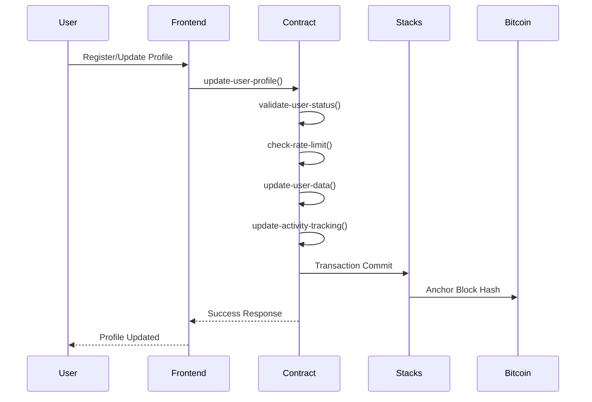
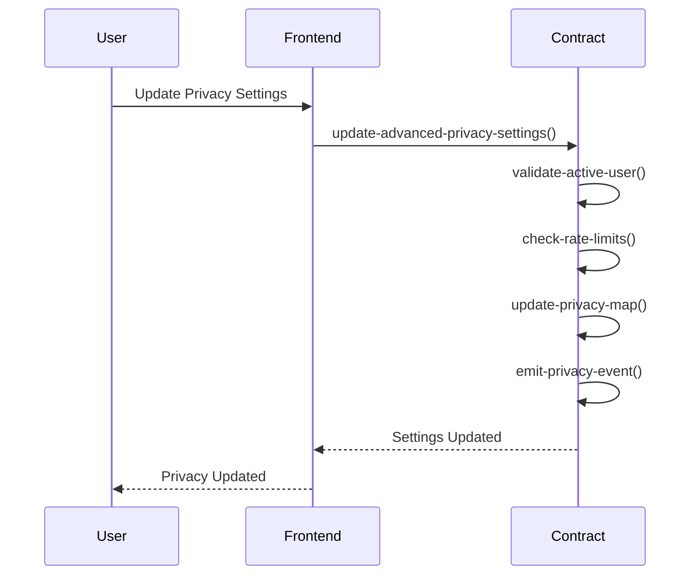
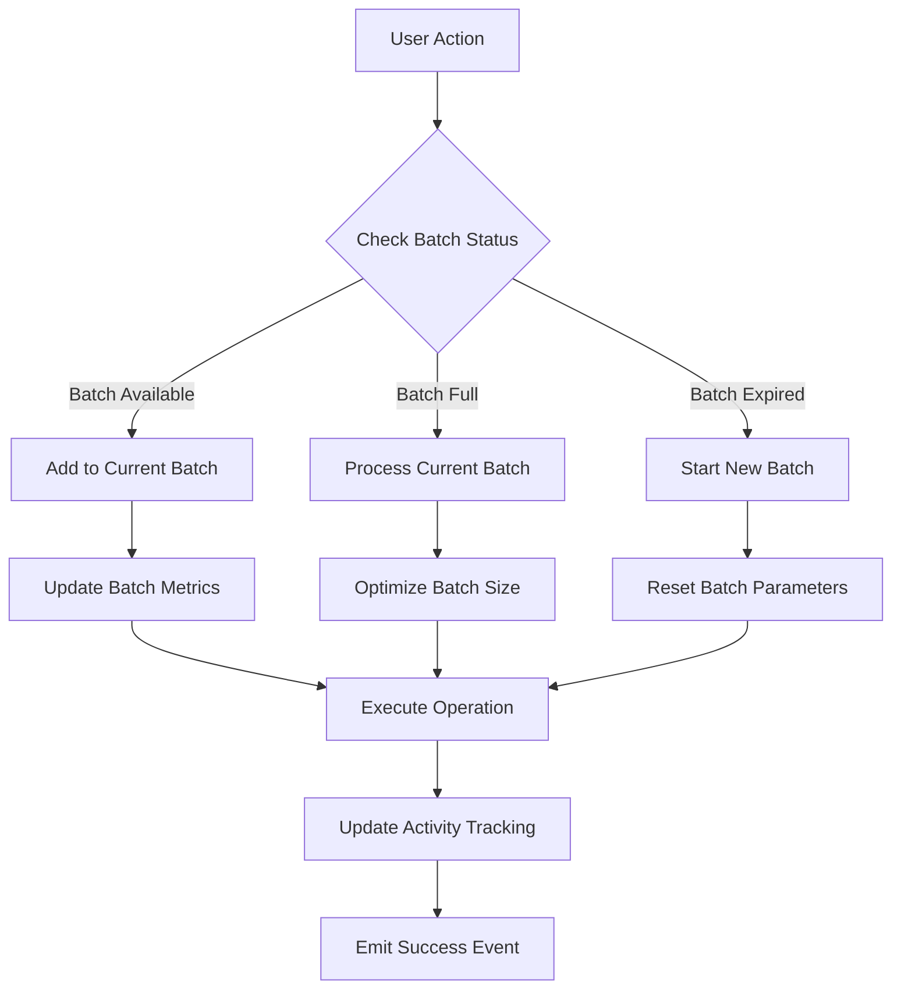

# BitSocial - Sovereign Social Protocol

[](https://stacks.co)
[](https://bitcoin.org)

## 🚀 Overview

BitSocial represents a paradigm shift in decentralized social networking, combining Bitcoin's immutable security with Stacks Layer 2 smart contract capabilities. Built for enterprises, communities, and privacy-conscious individuals who demand complete sovereignty over their social data while maintaining seamless user experiences.

### Key Features

- **🔐 Military-Grade Privacy**: End-to-end encryption with granular privacy controls
- **⚡ Intelligent Performance**: Adaptive batch processing for optimal throughput
- **🛡️ Anti-Spam Protection**: Sophisticated rate limiting and abuse prevention
- **🔗 Bitcoin Security**: Leverages Bitcoin's hash power for ultimate immutability
- **🏢 Enterprise Ready**: Institutional-grade compliance and scalability
- **🎯 User Sovereignty**: Complete control over personal data and social connections

## 📋 Table of Contents

- [System Architecture](#system-architecture)
- [Contract Architecture](#contract-architecture)
- [Data Flow](#data-flow)
- [Installation](#installation)
- [Usage](#usage)
- [API Reference](#api-reference)
- [Security](#security)
- [Contributing](#contributing)
- [License](#license)

## 🏗️ System Architecture

BitSocial operates as a multi-layered decentralized social network built on the Stacks blockchain:

```
┌─────────────────────────────────────────────────────────────┐
│                    Frontend Applications                     │
│          (Web, Mobile, Desktop, Third-party DApps)         │
└─────────────────────┬───────────────────────────────────────┘
                      │
┌─────────────────────┴───────────────────────────────────────┐
│                    BitSocial API Layer                      │
│          (GraphQL, REST, WebSocket Real-time)              │
└─────────────────────┬───────────────────────────────────────┘
                      │
┌─────────────────────┴───────────────────────────────────────┐
│                 Stacks Smart Contracts                      │
│    ┌─────────────┐  ┌─────────────┐  ┌─────────────┐      │
│    │   BitSocial │  │ Rate Limiter│  │ Privacy Mgr │      │
│    │   Core      │  │   Module    │  │   Module    │      │
│    └─────────────┘  └─────────────┘  └─────────────┘      │
└─────────────────────┬───────────────────────────────────────┘
                      │
┌─────────────────────┴───────────────────────────────────────┐
│                   Stacks Blockchain                         │
│              (Layer 2 Consensus & Execution)               │
└─────────────────────┬───────────────────────────────────────┘
                      │
┌─────────────────────┴───────────────────────────────────────┐
│                   Bitcoin Blockchain                        │
│                (Security & Finality Layer)                 │
└─────────────────────────────────────────────────────────────┘
```

### Architecture Principles

- **Separation of Concerns**: Modular design with distinct layers for presentation, business logic, and data persistence
- **Scalability First**: Intelligent batch processing and caching mechanisms for high-throughput operations
- **Security by Design**: Multi-layered security with encryption, rate limiting, and access controls
- **Decentralization**: No single points of failure, censorship-resistant architecture

## 🔧 Contract Architecture

The BitSocial smart contract is architected with enterprise-grade patterns and best practices:

### Core Components

```
BitSocial Smart Contract
├── Constants & Configuration
│   ├── Error Constants (Standardized error handling)
│   ├── Status Constants (User lifecycle states)
│   ├── Rate Limiting Constants (Anti-spam protection)
│   └── Batch Processing Constants (Performance optimization)
│
├── Data Storage Layer
│   ├── Users Map (Primary user profiles)
│   ├── UserPrivacy Map (Granular privacy controls)
│   ├── RateLimits Map (Anti-abuse mechanisms)
│   ├── UserBatches Map (Performance optimization)
│   ├── UserActivity Map (Analytics & security)
│   ├── Friendships Map (Social connections)
│   └── BlockedUsers Map (Safety mechanisms)
│
├── Internal Logic Layer
│   ├── Rate Limit Validation (Smart throttling)
│   ├── Activity Tracking (User analytics)
│   ├── Privacy Controls (Access management)
│   ├── Security Checks (Authentication & authorization)
│   └── Utility Functions (Mathematical operations)
│
└── Public API Layer
    ├── Profile Management (User data operations)
    ├── Privacy Settings (Granular controls)
    ├── Batch Optimization (Performance tuning)
    └── Session Management (Authentication tracking)
```

### Design Patterns

- **Map-Reduce Pattern**: Efficient data storage and retrieval using Clarity maps
- **Rate Limiting Pattern**: Sliding window rate limiting with automatic reset
- **Batch Processing Pattern**: Adaptive batch sizing based on usage patterns
- **Privacy by Design**: Default-secure privacy settings with opt-in visibility
- **Event Sourcing**: Comprehensive event logging for auditability

## 🔄 Data Flow

### User Registration & Profile Management



### Privacy Settings Management



### Batch Processing Optimization



## 📦 Installation

### Prerequisites

- Node.js 16+
- Stacks CLI 2.0+
- Clarinet (for local development)
- Docker (optional, for containerized deployment)

### Quick Start

```bash
# Clone the repository
git clone https://github.com/amelia-liam/bit-social.git
cd bit-social

# Install dependencies
npm install

# Setup local Stacks environment
clarinet new bitsocial-local
cd bitsocial-local

# Deploy contract to local network
clarinet contract deploy bitsocial contracts/bitsocial.clar

# Run tests
clarinet test
```

### Production Deployment

```bash
# Deploy to Stacks Testnet
stx deploy-contract bitsocial.clar --testnet

# Deploy to Stacks Mainnet (requires sufficient STX)
stx deploy-contract bitsocial.clar --mainnet
```

## 🔌 Usage

### Initialize User Profile

```javascript
import { StacksTestnet } from '@stacks/network';
import { callContractFunction } from '@stacks/transactions';

const updateProfile = async (name, metadata) => {
  const txOptions = {
    contractAddress: 'SP2J6ZY48GV1EZ5V2V5RB9MP66SW86PYKKNRV9EJ7',
    contractName: 'bitsocial',
    functionName: 'update-user-profile',
    functionArgs: [
      someCV(name),
      someCV(metadata),
      noneCV(),
      noneCV()
    ],
    network: new StacksTestnet(),
  };
  
  return await makeContractCall(txOptions);
};
```

### Configure Privacy Settings

```javascript
const updatePrivacy = async (settings) => {
  const txOptions = {
    contractAddress: 'SP2J6ZY48GV1EZ5V2V5RB9MP66SW86PYKKNRV9EJ7',
    contractName: 'bitsocial',
    functionName: 'update-advanced-privacy-settings',
    functionArgs: [
      boolCV(settings.friendListVisible),
      boolCV(settings.statusVisible),
      boolCV(settings.metadataVisible),
      boolCV(settings.lastSeenVisible),
      boolCV(settings.profileImageVisible),
      boolCV(settings.encryptionEnabled)
    ],
    network: new StacksTestnet(),
  };
  
  return await makeContractCall(txOptions);
};
```

## 📚 API Reference

### Public Functions

#### `update-user-profile`

Updates user profile with optional fields.

**Parameters:**

- `name` (optional string-ascii 64): User display name
- `metadata` (optional string-utf8 256): Additional user metadata
- `encryption-key` (optional buff 32): User's encryption key
- `profile-image` (optional string-utf8 256): Profile image URL

#### `update-advanced-privacy-settings`

Configures granular privacy controls.

**Parameters:**

- `friend-list-visible` (bool): Friend list visibility
- `status-visible` (bool): Online status visibility
- `metadata-visible` (bool): Metadata visibility
- `last-seen-visible` (bool): Last seen timestamp visibility
- `profile-image-visible` (bool): Profile image visibility
- `encryption-enabled` (bool): End-to-end encryption toggle

#### `optimize-batch-size`

Automatically optimizes batch processing parameters.

**Parameters:**

- `user` (principal): Target user principal

#### `record-login`

Records user login for analytics and security.

**Returns:** `(response bool uint)`

## 🔒 Security

### Security Features

- **Rate Limiting**: Prevents spam and abuse with intelligent throttling
- **Input Validation**: Comprehensive validation of all user inputs
- **Access Controls**: Role-based permissions and authentication
- **Encryption Support**: Built-in support for end-to-end encryption
- **Audit Logging**: Complete event logging for security monitoring

### Security Best Practices

1. **Never store private keys** in contract state
2. **Validate all inputs** before processing
3. **Use secure defaults** for privacy settings
4. **Monitor rate limits** to prevent abuse
5. **Regular security audits** of contract code

### Vulnerability Reporting

Please report security vulnerabilities to: <security@bitsocial.protocol>

## 🤝 Contributing

We welcome contributions from the community! Please see our [Contributing Guidelines](CONTRIBUTING.md) for details.

### Development Setup

```bash
# Fork and clone the repository
git clone https://github.com/amelia-liam/bit-social.git

# Install development dependencies
npm install --dev

# Run local development environment
clarinet integrate

# Run comprehensive tests
npm run test:comprehensive
```

## 📄 License

This project is licensed under the MIT License - see the [LICENSE](LICENSE) file for details.

## 🌟 Acknowledgments

- **Stacks Foundation** for the incredible Layer 2 infrastructure
- **Bitcoin Core** for the security foundation
- **The Clarity Community** for development support and best practices
- **Open Source Contributors** who make decentralized social networking possible
